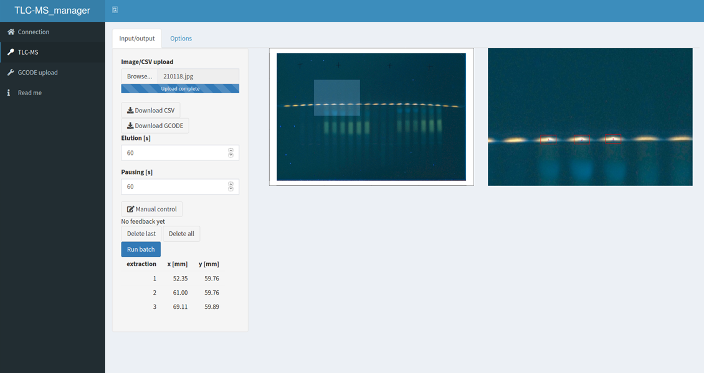

OC_manager
===========

# Shiny app to operate the autoTLC-MS interface



## Ubuntu 16.04 LTS image

Follow [this link](https://jlubox.uni-giessen.de/dl/fi5d7vosAXVt6w1cAmn4RBZ2/OC_manager_DF.gz) to download an image of Ubuntu 16.04 with the installed TLC-MS_manager, last updated: 2021-01-15 (1 GB).


## Manual Installation using the installation script

### Clone this github repository

```
git clone https://github.com/OfficeChromatography/TLC-MS_manager.git
```

### Installation

In the downloaded folder ```home/pi/TLC-MS_manager```, you will find an installation script to be executed (last updated and tested 2021-01-15). Therefore, open the file ```sudo_bash.txt```, and copy the command line into the terminal.

In case of installation problems, the log file ```TLC-MS_manager-install.txt``` (in home/pi) can be checked for error messages concerning, for example, missing dependencies.


## Run

### Started at reboot with crontab

Crontab is a job scheduler for UNIX-like system. The file can be accessed with the following commands and the lines inside will be executed at the appropriate moment.

```
sudo crontab -e
```

Once in the editor, add this line which will launch the application at reboot. 

```
@reboot Rscript /home/pi/OC_manager/app_exec.R
```

If a static IP had been set, the application will also be available at the IP (in the browser) from a remote computer in the network.


### Browser configuration

Configure the browser to start with the custom URL https://127.0.0.1/.


### Directly from R (in case of problem to catch the errors)

Being in a terminal: 

```
cd TLC-MS_manager
R
shiny::runApp()
```


## Documentation

A pdf is available in the folder ```Instruction```.

The same instruction is also available in the "Read me" tab of the TLC-MS_manager.

