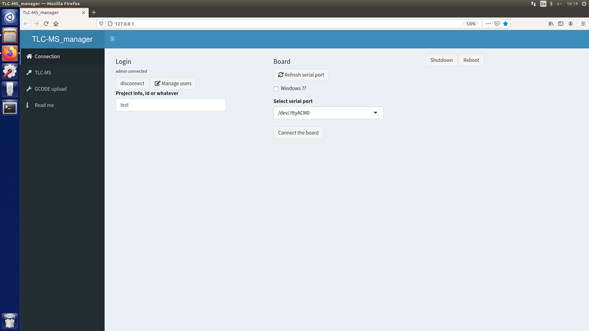
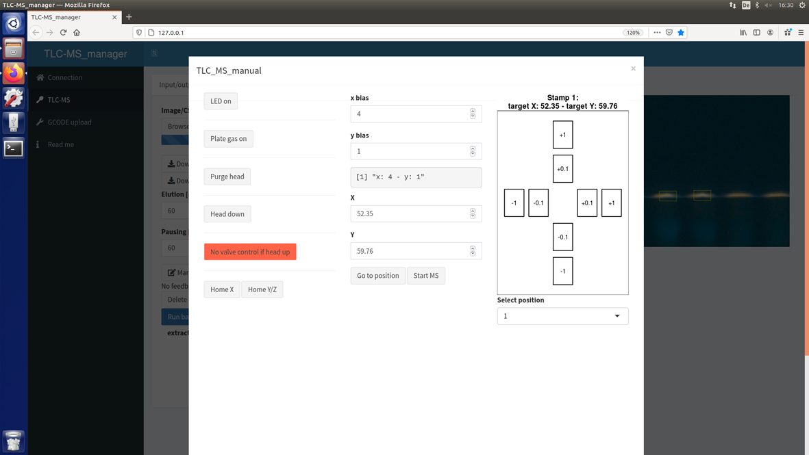

# TLC-MS_manager user manual

The TLC-MS_manager is an open-source software to control the autoTLC-MS interface. 
It is devided into three main functions, which can be accessed via the main menu on the left side.

## Connection tab

Before you can use the autoTLC-MS interface, you have to establish a connection between the interface and the TLC-MS_manager software. 
Click on the **connection tab**.
Choose the appropriate serial port in the drop-down menu on the right and click on the "Connect the board" button.
After the connection is established, the button displays "Disconnect the board". 
In case of communication problems, click the "Refresh serial port" button and click on "Connect the board" again. 
With the help of the buttons on the left side ("disconnect", "Manage users", "Project info, id or whatever"), a user management system can be built if desired. 

## TLC-MS tab

Click on the **TLC-MS tab**. Under this tab you can find all functions necessary for automated TLC-MS measurements.

### Image upload and zone selection

Click on the "Input/output" tab in the top left corner. 
Images (file formats .jpg, .png, .bmp, .tif) of chromatograms can be uploaded by clicking on the "Browse" button under "Image/CSV upload". 
You can upload up to four images at once by marking all desired picture files before clicking "okay".
The same image is displayed two times. Click on the image on the left side and drag the cursor over the image to create a rectangle selection.
Double-click on the selection. The selected area is displayed enlarged on the right side. 
On the enhanced image on the right side, click on the band or spot you would like to choose for elution. 
The selected spot is marked with a red square.
The chosen position is translated into a batch, displayed on the left side below the buttons "Delet last", "Delete all" and "Run batch".
After you selected all positions in the enhanced area, double-click on the image on the left side outside the selection to undo the selection. 
The image is displayed in full frame again on the right side. 
Continue with other areas on your image until you have chosen all zones for elution. 
Be careful to only click once on a spot for elution. If you double-click, the same spot is chosen twice.
You can undo the last selection by clicking on the "Delete last" button. 
You can delete all selected positions by clicking the "Delete all" button.
Alternatively, by clicking on "Image/CSV upload", you can upload a comma-separated values (CSV) file written in the following format:

|        | extraction | x[mm] | y[mm] |
|--------|------------|-------|-------|
|   1    |   1        |  x1   |  y1   |
|   2    |   2        |  x2   |  y2   |
|   3    |   3        |  x3   |  y3   |

etc. 

The CSV file is translated into a batch and the elution positions are marked with red squares.
If you would like to control the marked positions with the help of a plate image, you can upload images after you have uploaded the CSV file.
To delete the batch, click on "Delete all".
To download the batch in a CSV format, click on the "Download CSV" button.
To download commands as G-code, click on the "Download GCODE" button.

### Profile selection

Before you can run a batch, it is important to choose the right elution profile.
Click on the "Options" tab to enter the profile selection menu. 
In the "Profile name to load" drop-down menu, choose the appropriate G-code command file.
Different profiles for diverse setups have been provided by default.
After loading a profile, you can adjust it according to your needs.
All commands under "Before batch" are only performed once before the batch.
If you want to record one single file for all zone elutions, you must set the start signal for MS or LC here.
All commands under "Between head" are repeated in between each zone elution. 
If you want to record individual files for each zone elution, you must set the start signal for MS or LC here.
Do not change the order of commands except for start signals. 
If necessary, you can adjust the waiting times between each command by adjusting the time [ms] written directly behind "G4 P".
All commands under "After batch" are only performed once after the batch.
The new file can be saved by inserting a name into the empty field under "Profile name to save" and clicking on "Save profile".
You can also modify profiles in R and save them as .Rdata files in the folder TLC-MS_manager\tlcms_profile.
Enter a color under "Color on plots" to change the color of the squares on the image that was uploaded under the "Input/output" tab.

### Manual control

The manual control menu provides all functions necessary for manual TLC-MS measurements. 
Click on the "LED on" button to switch on the LED. If the LED is on, the same button displays "LED off". Use this button to switch off the LED.
Click on the "Plate gas on" button to switch on the plate gas for removal of particles on the plate surface.
If the plate gas is on, the same button displays "Plate gas off". Use this button to switch off the plate gas.
Click on the "Purge head" button to clean the elution head with a gas stream. 
The drawer is pushed out and catches the particles blown out of the elution head.
The cleaning cycle is finished after 5 seconds.
Click on the "Head down" button to lower the elution head onto the plate. The button now displays "Head up", while the button below now displays "Valve elution". 
Click on the "Valve elution" button to rotate the electric six-port valve into elution position. 
The "Head up" button cannot be activated during valve elution. 
After the desired elution time, click on "Valve bypass" to rotate the valve into bypass position.
Click on the "Head up" button to move the elution head up. After each elution, purge the elution head.
To start an MS acquisition, click on the "Start MS" button.
These are the only functions necessary for manual zone elution.

Before every automated measurement, subsequently click on the "Home X" and "Home Y/Z" buttons. 
"Home X" induces movement along the x-axis, while "Home Y/Z" induces movement along the y-axis.
For the latter, two motors are necessary, which is why the button displays "Y/Z", one for each motor.
The plate holder then moves to the end stop of the respective axis. After that, you have to adjust the positioning bias.
Move the plate holder towards you by entering the values "100" in the "X" field and "150" in the "Y" field.
Click on "Go to position" to move the plate holder to the selected position.
Mount the plate you would like to work with, upload an image of the plate and choose a prominent zone or a manually made mark for elution as described in the previous section of this manual.
Go back to "Manual control" and in the "Select position" drop-down menu, choose the spot you have just marked as an elution zone.
The coordinates of the selected position are now displayed in the "X" and "Y" fields.
Alternatively, enter a value in the "X" and "Y" fields instead of choosing it on the image.
Click on "Go to position" to move the plate holder to the selected position. 
Switch on the LED and check the position.
If the LED cross is not exactly in the middle of the selected spot, adjust the bias by clicking on the +/- 1/0.1 mm buttons on the right until the LED is directly over the selected spot.
Alternatively, enter an appropriate value in the "x bias" or "y bias" fields. Now the positioning error is compensated.
For this way of adjustment, it is recommended to verify that the LED is correctly aligned with the elution head position beforehand. 

### Running a batch 

After you have chosen all positions for elution or uploaded a CSV file, chosen the right profile 
and have adjusted the positioning bias, everything is ready for your zones to be eluted.
In the "Input/output" tab, enter the desired elution time and rinsing time (waiting time in between elutions) into the fields.
Click on the "Run batch" button to start the run. Note that after you have started a batch, there is no option to stop the run.

## GCODE upload tab

Click on the **GCODE upload tab**. It can be used to try out G-code commands, for example after modification of the autoTLC-MS interface
or if you would like to test which pin is responsible for which function. 
Enter the G-code you would like to execute and click on the "Launch G-code" button.

